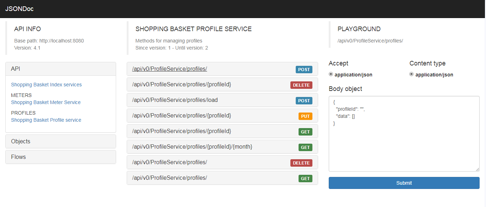

# Shopping Basket
Simple REST Application to handle consumption of electricity.

## Build:

To build you will need Git and JDK 8. Be sure that your JAVA_HOME environment variable points to the jdk1.8.0 folder extracted from the JDK download.

## Get the Source Code
1. **git clone https://github.com/skovacev/shopping-basket.git**
2. **cd shopping-basket**

## Build from the Command Line
To compile, test, build all jars, distribution zips, and docs use:
*   **mvn clean package** 

The first time you run the build it may take a while to download maven and all build dependencies, as well as to run all tests.

## Import Into Your IDE
Ensure JDK 8 is configured properly in the IDE. Then follow the instructions.
*  Import project as maven project
*  Open location where you cloned your repo
*  Select project shopping-basket

## Documentation
When you start your application documentation will be exposed as JSON file directly on server:
*  http://localhost:8080/jsondoc

###  Documentation UI
During the process of maven packaging documentation will be generated under target folder
*  target/jsondoc-ui/jsondoc-ui.html

Please check [JsonDoc](http://jsondoc.org/index.html "JsonDoc") for more information's. 

 
 